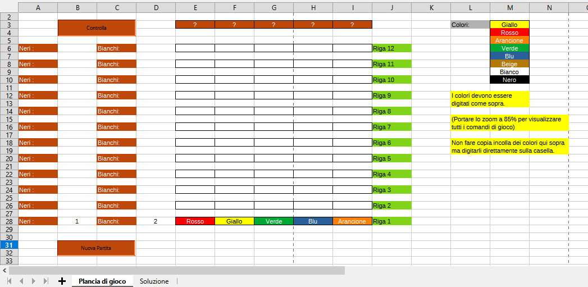

# Super-Master-Mind-Excel
This is a simulator of the well-known game Super Master Mind, the rules are exactly those of the game in box, only that you play alone and there is no exchange of roles of the two players. For the rules go [here](https://www.bigcream.it/it/Giochi/mastermind-super.html).

  

# Installation
* Clone this repository
* If you haven’t already done the basic macro execution skills in LibreOffice, do as follows:
  * Open LibreOffice calc
  * Follow the path `tools>options>security>macro security` and set the value "average"
  * Open the file `.ods` (the file `.bas` in the repository is not linked to the spreadsheet, it is only a copy of the code contained within the project, so you can move it somewhere else without problem)
# Play
